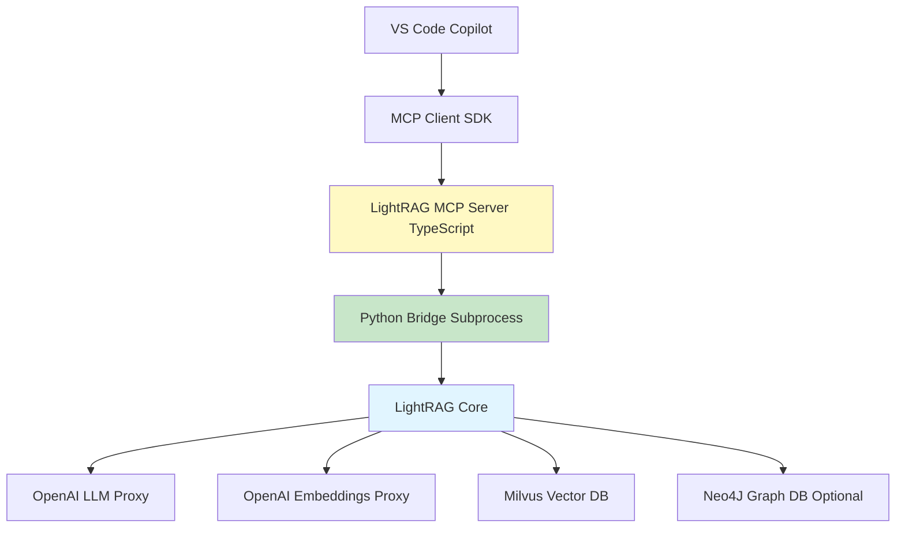
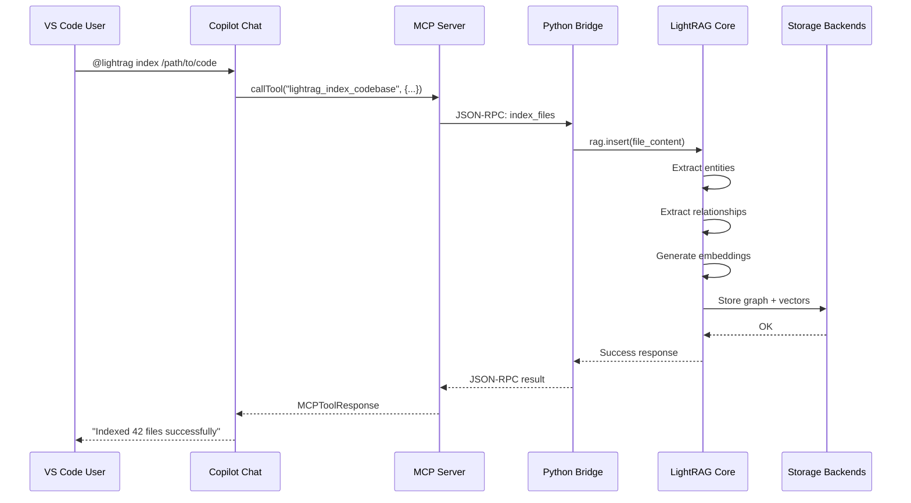
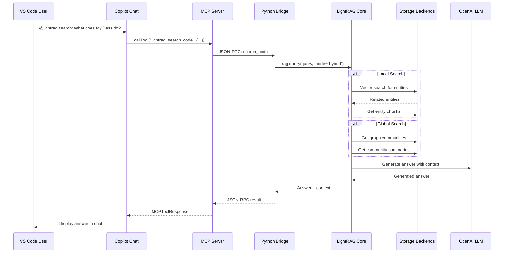
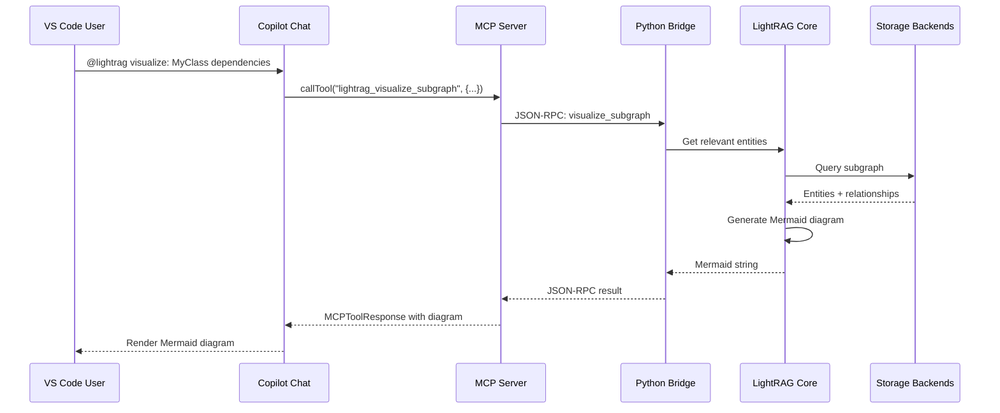
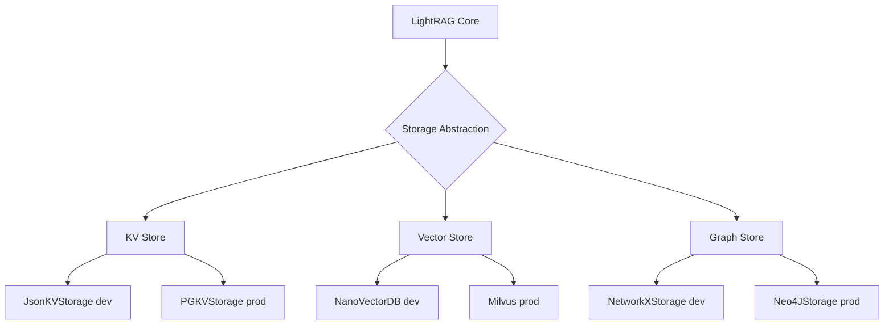

# LightRAG MCP Server Architecture

**Project**: lightrag-mcp-server  
**Version**: 1.0  
**Last Updated**: 2025-11-12

---

## Table of Contents

1. [System Architecture](#1-system-architecture)
2. [Component Details](#2-component-details)
3. [Data Flow](#3-data-flow)
4. [Storage Layer](#4-storage-layer)
5. [Communication Protocol](#5-communication-protocol)
6. [Extension Points](#6-extension-points)
7. [Performance Considerations](#7-performance-considerations)

---

## 1. System Architecture

### 1.1 High-Level Architecture



### 1.2 Component Layers

The system is organized into four main layers:

1. **Client Layer** (VS Code Copilot)
   - User interaction via chat interface
   - MCP protocol client implementation
   - Workspace context management

2. **Server Layer** (TypeScript MCP Server)
   - MCP protocol server implementation
   - Tool registration and routing
   - Request validation and error handling
   - Response formatting

3. **Bridge Layer** (Python Subprocess)
   - TypeScript-Python communication
   - JSON-RPC message handling
   - Process lifecycle management
   - Health monitoring

4. **Core Layer** (LightRAG)
   - Knowledge graph construction
   - Vector embeddings generation
   - Multi-mode retrieval
   - LLM-based response generation

---

## 2. Component Details

### 2.1 MCP Server (TypeScript)

**Location**: `src/index.ts`

**Responsibilities**:
- Initialize MCP server with stdio transport
- Register tool handlers
- Validate incoming requests
- Format responses according to MCP protocol
- Handle errors gracefully

**Key Classes**:

```typescript
class LightRAGMCPServer {
  private server: Server;
  private bridge: LightRAGBridge;
  
  constructor(config: ServerConfig);
  async start(): Promise<void>;
  async stop(): Promise<void>;
  registerTools(): void;
  handleError(error: Error): MCPError;
}
```

**Configuration**:

```typescript
interface ServerConfig {
  workingDir: string;
  llmConfig: LLMConfig;
  storageConfig: StorageConfig;
  indexingConfig: IndexingConfig;
}
```

### 2.2 Python Bridge (TypeScript)

**Location**: `src/lightrag-bridge.ts`

**Responsibilities**:
- Spawn Python subprocess with lightrag_wrapper.py
- Implement JSON-RPC over stdin/stdout
- Handle request timeouts (default: 60s)
- Auto-restart on process crashes
- Health check monitoring (ping/pong)

**Key Classes**:

```typescript
class LightRAGBridge {
  private process: ChildProcess;
  private requestId: number;
  private pendingRequests: Map<number, Promise>;
  private healthCheckInterval: NodeJS.Timeout;
  
  constructor(config: BridgeConfig);
  async start(): Promise<void>;
  async stop(): Promise<void>;
  async call(method: string, params: any, options?: CallOptions): Promise<any>;
  isRunning(): boolean;
  private restart(): Promise<void>;
  private healthCheck(): Promise<void>;
}
```

**Communication Protocol**:

Request:
```json
{
  "jsonrpc": "2.0",
  "id": 123,
  "method": "search_code",
  "params": {
    "query": "What is MyClass?",
    "mode": "hybrid"
  }
}
```

Response:
```json
{
  "jsonrpc": "2.0",
  "id": 123,
  "result": {
    "answer": "MyClass is a...",
    "context": [...],
    "metadata": {...}
  }
}
```

Error:
```json
{
  "jsonrpc": "2.0",
  "id": 123,
  "error": {
    "code": -32603,
    "message": "Internal error",
    "data": {...}
  }
}
```

### 2.3 LightRAG Wrapper (Python)

**Location**: `python/lightrag_wrapper.py`

**Responsibilities**:
- Initialize LightRAG instance
- Handle JSON-RPC requests from stdin
- Execute LightRAG operations
- Send JSON-RPC responses to stdout
- Manage LightRAG lifecycle

**Key Classes**:

```python
class LightRAGWrapper:
    def __init__(self, config: dict):
        self.rag = LightRAG(**config)
        self.logger = setup_logger()
    
    def handle_request(self, request: dict) -> dict:
        """Process JSON-RPC request"""
        
    def index_files(self, params: dict) -> dict:
        """Index code files"""
        
    def search_code(self, params: dict) -> dict:
        """Search code using LightRAG"""
        
    def get_entity(self, params: dict) -> dict:
        """Get entity details"""
        
    def get_relationships(self, params: dict) -> dict:
        """Get entity relationships"""
        
    def visualize_subgraph(self, params: dict) -> dict:
        """Generate Mermaid diagram"""
        
    def get_indexing_status(self, params: dict) -> dict:
        """Get indexing status"""
```

**Initialization**:

```python
config = {
    "working_dir": os.environ["LIGHTRAG_WORKING_DIR"],
    "llm_model_func": openai_complete_if_cache,
    "llm_model_name": os.environ.get("OPENAI_MODEL", "gpt-4"),
    "llm_model_kwargs": {
        "api_key": os.environ["OPENAI_API_KEY"],
        "base_url": os.environ.get("OPENAI_BASE_URL"),
    },
    "embedding_func": EmbeddingFunc(...),
}
```

### 2.4 Tool Handlers

**Location**: `src/tools/*.ts`

Each tool handler follows a consistent pattern:

```typescript
interface ToolHandler {
  name: string;
  description: string;
  inputSchema: JSONSchema;
  execute(params: any): Promise<MCPToolResponse>;
}
```

**Example Tool**: `lightrag_search_code`

```typescript
export const searchCodeTool: ToolHandler = {
  name: "lightrag_search_code",
  description: "Search code using graph-based retrieval",
  inputSchema: {
    type: "object",
    properties: {
      query: { type: "string", description: "Search query" },
      mode: { 
        type: "string", 
        enum: ["local", "global", "hybrid", "mix", "naive"],
        default: "hybrid"
      },
      top_k: { type: "number", default: 10 },
      only_context: { type: "boolean", default: false }
    },
    required: ["query"]
  },
  
  async execute(params: SearchCodeParams): Promise<MCPToolResponse> {
    // Validate params
    validateParams(params, this.inputSchema);
    
    // Call bridge
    const result = await bridge.call('search_code', params);
    
    // Format response
    return {
      content: [{
        type: "text",
        text: JSON.stringify({
          answer: result.answer,
          context: result.context,
          mode: params.mode
        }, null, 2)
      }]
    };
  }
};
```

---

## 3. Data Flow

### 3.1 Indexing Flow



### 3.2 Search Flow



### 3.3 Visualization Flow



---

## 4. Storage Layer

### 4.1 Storage Architecture



### 4.2 Storage Backends

#### 4.2.1 Key-Value Store

**Purpose**: Store document chunks and metadata

**Development**: JsonKVStorage
- File-based JSON storage
- Simple, no dependencies
- Suitable for <10K documents

**Production**: PostgreSQL (PGKVStorage)
- Scalable, ACID compliant
- Better for >10K documents
- Transaction support

**Schema**:
```json
{
  "doc_id": "unique_id",
  "content": "file content",
  "metadata": {
    "path": "/path/to/file",
    "hash": "sha256_hash",
    "indexed_at": "2025-11-12T00:00:00Z"
  }
}
```

#### 4.2.2 Vector Store

**Purpose**: Store and search code embeddings

**Development**: NanoVectorDB
- In-memory vector database
- Fast for small datasets (<100K vectors)
- No external dependencies

**Production**: Milvus
- Distributed vector database
- Scalable to billions of vectors
- GPU-accelerated similarity search
- HNSW indexing

**Configuration**:
```python
# Milvus connection
milvus_config = {
    "uri": "172.29.61.251:19530",
    "collection_name": "code_embeddings",
    "dim": 1536,  # OpenAI embedding dimension
    "index_type": "HNSW",
    "metric_type": "COSINE"
}
```

**Schema**:
```python
{
    "id": str,           # Unique chunk ID
    "vector": List[float],  # Embedding vector
    "entity_name": str,  # Entity name
    "chunk_content": str,  # Text content
    "metadata": dict     # Additional metadata
}
```

#### 4.2.3 Graph Store

**Purpose**: Store entity relationships and graph structure

**Development**: NetworkX
- File-based graph storage (pickle/graphml)
- Simple, pure Python
- Suitable for <10K entities

**Production**: Neo4J
- Native graph database
- Cypher query language
- Scalable to millions of nodes
- ACID transactions

**Schema**:

Nodes (Entities):
```cypher
CREATE (e:Entity {
  name: "MyClass",
  type: "class",
  description: "A class that...",
  source_file: "/path/to/file.cpp"
})
```

Relationships:
```cypher
CREATE (e1:Entity)-[:CALLS {
  confidence: 0.95,
  line_number: 42
}]->(e2:Entity)
```

### 4.3 Storage Fallback Chain

The system automatically falls back to simpler storage backends if production ones are unavailable:

```typescript
async function selectStorageBackends(): Promise<StorageConfig> {
  const config: StorageConfig = {
    kv: 'json',
    vector: 'nano',
    graph: 'networkx'
  };
  
  // Try to connect to Neo4J
  try {
    await testNeo4JConnection(process.env.NEO4J_URI);
    config.graph = 'neo4j';
  } catch (err) {
    logger.warn('Neo4J unavailable, using NetworkX');
  }
  
  // Try to connect to Milvus
  try {
    await testMilvusConnection(process.env.MILVUS_ADDRESS);
    config.vector = 'milvus';
  } catch (err) {
    logger.warn('Milvus unavailable, using NanoVectorDB');
  }
  
  return config;
}
```

---

## 5. Communication Protocol

### 5.1 MCP Protocol

The Model Context Protocol (MCP) defines how VS Code Copilot communicates with the server.

**Transport**: stdio (stdin/stdout)

**Message Format**: JSON-RPC 2.0

**Capabilities**:
```json
{
  "capabilities": {
    "tools": {
      "listChanged": true
    }
  }
}
```

### 5.2 Tool Invocation

**Request**:
```json
{
  "jsonrpc": "2.0",
  "id": 1,
  "method": "tools/call",
  "params": {
    "name": "lightrag_search_code",
    "arguments": {
      "query": "What is MyClass?",
      "mode": "hybrid"
    }
  }
}
```

**Response**:
```json
{
  "jsonrpc": "2.0",
  "id": 1,
  "result": {
    "content": [
      {
        "type": "text",
        "text": "{\"answer\": \"MyClass is...\"}"
      }
    ]
  }
}
```

---

## 6. Extension Points

### 6.1 Custom Storage Backends

Implement the storage interface to add new backends:

```typescript
interface StorageBackend {
  connect(): Promise<void>;
  disconnect(): Promise<void>;
  
  // KV Store interface
  get(key: string): Promise<any>;
  set(key: string, value: any): Promise<void>;
  delete(key: string): Promise<void>;
  
  // Vector Store interface
  insert(vectors: Vector[]): Promise<void>;
  search(query: Vector, topK: number): Promise<SearchResult[]>;
  
  // Graph Store interface
  addNode(node: Node): Promise<void>;
  addEdge(edge: Edge): Promise<void>;
  query(cypher: string): Promise<any>;
}
```

### 6.2 Custom Embedding Models

Replace OpenAI embeddings with custom models:

```python
from lightrag import EmbeddingFunc

class CustomEmbeddingFunc(EmbeddingFunc):
    async def __call__(self, texts: List[str]) -> np.ndarray:
        # Your embedding logic
        embeddings = your_model.encode(texts)
        return embeddings

# Use in config
config = {
    "embedding_func": CustomEmbeddingFunc(
        embedding_dim=768,
        max_token_size=512
    )
}
```

### 6.3 Custom LLM Providers

Add support for non-OpenAI LLMs:

```python
async def custom_llm_func(
    prompt: str,
    system_prompt: str = None,
    **kwargs
) -> str:
    # Your LLM logic
    response = await your_llm.complete(prompt, **kwargs)
    return response

# Use in config
config = {
    "llm_model_func": custom_llm_func,
    "llm_model_kwargs": {
        "model": "your-model",
        "temperature": 0.7
    }
}
```

### 6.4 Custom Tools

Add new MCP tools:

```typescript
// src/tools/custom-tool.ts
export const customTool: ToolHandler = {
  name: "lightrag_custom_operation",
  description: "Custom operation description",
  inputSchema: {
    type: "object",
    properties: {
      param1: { type: "string" }
    },
    required: ["param1"]
  },
  
  async execute(params: any): Promise<MCPToolResponse> {
    const result = await bridge.call('custom_method', params);
    return {
      content: [{
        type: "text",
        text: JSON.stringify(result)
      }]
    };
  }
};

// Register in src/index.ts
server.registerTool(customTool);
```

---

## 7. Performance Considerations

### 7.1 Indexing Performance

**Optimization Strategies**:

1. **Batch Processing**
   - Process files in batches of 10-50
   - Parallelize embedding generation
   - Batch insert to vector/graph stores

2. **Incremental Updates**
   - Track file hashes to detect changes
   - Only re-index modified files
   - Partial graph updates

3. **Concurrent Processing**
   - Use worker threads for CPU-bound tasks
   - Limit concurrent LLM requests to avoid rate limits
   - Stream large files instead of loading into memory

**Benchmarks** (10K file codebase):
- Initial indexing: ~100 files/min
- Incremental updates: ~500 files/min
- Memory usage: ~1.5GB peak

### 7.2 Query Performance

**Optimization Strategies**:

1. **Caching**
   - Cache frequent queries (TTL: 1 hour)
   - Cache entity embeddings
   - Cache graph community structures

2. **Query Modes**
   - Use `local` mode for specific entity questions (<2s)
   - Use `global` mode for architectural questions (<5s)
   - Use `hybrid` mode for balanced results (<3s)

3. **Vector Search Tuning**
   - Optimize HNSW index parameters (ef_construction, M)
   - Use approximate search for large datasets
   - Pre-filter by metadata when possible

**Benchmarks**:
- Local search: P95 < 2s
- Global search: P95 < 5s
- Hybrid search: P95 < 3s

### 7.3 Memory Management

**Guidelines**:

1. **Bridge Process**
   - Restart after processing 1000 requests to clear memory
   - Monitor memory usage with health checks
   - Set max heap size: `--max-old-space-size=2048`

2. **Python Subprocess**
   - Use streaming for large files
   - Clear LightRAG cache periodically
   - Limit batch sizes

3. **Storage**
   - Use connection pooling
   - Implement pagination for large result sets
   - Close connections after use

---

## Related Documentation

- [Implementation Plan](./IMPLEMENTATION_PLAN.md)
- [Setup Guide](./SETUP.md)
- [Usage Guide](./USAGE.md)
- [Contributing Guide](./CONTRIBUTING.md)

---

**Document Version**: 1.0  
**Last Updated**: 2025-11-12
