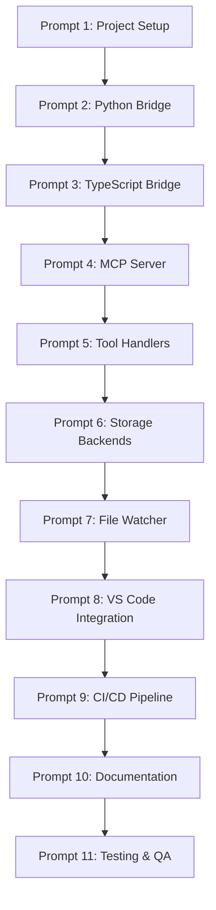

# LightRAG MCP Server: Cascading Implementation Prompts

**Project**: lightrag-mcp-server  
**Implementation Strategy**: Sequential agent handoffs with validation checkpoints  
**Current User**: netbrah  
**Date**: 2025-11-12

---

## Table of Contents

1. [Overview](#1-overview)
2. [Prompt Sequence](#2-prompt-sequence)
3. [Validation Checkpoints](#3-validation-checkpoints)
4. [Handoff Protocol](#4-handoff-protocol)

---

## 1. Overview

This document breaks down the LightRAG MCP Server implementation into cascading prompts that can be executed sequentially by agents. Each prompt is self-contained with clear:

- **Context**: What information the agent needs
- **Task**: What the agent should accomplish
- **Deliverables**: What artifacts the agent should produce
- **Acceptance Criteria**: How to validate the agent's work
- **Handoff**: What to pass to the next agent

### 1.1 Dependency Graph



---

## 2. Prompt Sequence

### Prompt 1: Project Initialization & Setup

**Agent Role**: DevOps Engineer

**Context Provided**:
- GitHub organization: `netbrah`
- Repository name: `lightrag-mcp-server`
- Base template: `netbrah/claude-context`
- Dependencies: LightRAG core library

**Task**:
Initialize the project repository with proper structure and configuration.

**Deliverables**:
1. GitHub repository created at `netbrah/lightrag-mcp-server`
2. Initial directory structure (see `IMPLEMENTATION_PLAN.md` § 2)
3. `.gitignore` configured for Node.js + Python
4. `package.json` with TypeScript dependencies
5. `python/requirements.txt` with LightRAG dependencies
6. `.env.example` with all configuration variables
7. `README.md` with project overview
8. Branch protection rules configured

**Acceptance Criteria**:
- [ ] Repository accessible at `https://github.com/netbrah/lightrag-mcp-server`
- [ ] `npm install` succeeds without errors
- [ ] `pip install -r python/requirements.txt` succeeds
- [ ] TypeScript compiles: `npx tsc --noEmit`
- [ ] All example environment variables documented in `.env.example`

**Files to Create**:
```
lightrag-mcp-server/
├── .gitignore
├── package.json
├── tsconfig.json
├── .env.example
├── README.md
├── python/
│   └── requirements.txt
└── src/
    └── (empty, ready for next prompt)
```

**Handoff to Prompt 2**:
- Repository URL
- Clean `npm install` status
- Clean `pip install` status

---

### Prompt 2: Python Bridge Wrapper

**Agent Role**: Python Backend Engineer

**Context Provided**:
- Repository from Prompt 1
- LightRAG documentation: https://github.com/HKUDS/LightRAG
- JSON-RPC 2.0 specification
- Required methods: `index_files`, `search_code`, `get_entity`, `get_relationships`, `visualize_subgraph`

**Task**:
Implement the Python wrapper that bridges TypeScript to LightRAG via JSON-RPC over stdin/stdout.

**Deliverables**:
1. `python/lightrag_wrapper.py` with `LightRAGWrapper` class
2. JSON-RPC request/response handler
3. LightRAG initialization with configurable storage backends
4. Error handling and logging
5. Unit tests: `python/tests/test_wrapper.py`

**Implementation Details**:

```python
# python/lightrag_wrapper.py

import sys
import json
import logging
from lightrag import LightRAG, QueryParam
from lightrag.llm import openai_complete_if_cache
from lightrag.utils import EmbeddingFunc

class LightRAGWrapper:
    def __init__(self, config: dict):
        """Initialize LightRAG with configuration"""
        self.config = config
        self.logger = self._setup_logger()
        self.rag = self._initialize_lightrag()
    
    def _setup_logger(self) -> logging.Logger:
        """Setup logging configuration"""
        # Implementation
    
    def _initialize_lightrag(self) -> LightRAG:
        """Initialize LightRAG instance"""
        # Implementation
    
    def handle_request(self, request: dict) -> dict:
        """
        Handle JSON-RPC 2.0 request
        
        Request format:
        {
            "jsonrpc": "2.0",
            "id": 1,
            "method": "search_code",
            "params": {...}
        }
        """
        # Implementation
    
    def index_files(self, params: dict) -> dict:
        """Index code files"""
        # Implementation
    
    def search_code(self, params: dict) -> dict:
        """Search code using LightRAG"""
        # Implementation
    
    def get_entity(self, params: dict) -> dict:
        """Get entity details"""
        # Implementation
    
    def get_relationships(self, params: dict) -> dict:
        """Get entity relationships"""
        # Implementation
    
    def visualize_subgraph(self, params: dict) -> dict:
        """Generate Mermaid diagram"""
        # Implementation
    
    def run(self):
        """Main event loop: read from stdin, write to stdout"""
        # Implementation

if __name__ == "__main__":
    config = {
        "working_dir": os.environ["LIGHTRAG_WORKING_DIR"],
        # ... other config
    }
    wrapper = LightRAGWrapper(config)
    wrapper.run()
```

**Acceptance Criteria**:
- [ ] `python/lightrag_wrapper.py` implements all required methods
- [ ] JSON-RPC requests are correctly parsed and handled
- [ ] JSON-RPC responses follow specification
- [ ] Errors are properly formatted as JSON-RPC errors
- [ ] Unit tests pass: `pytest python/tests/`
- [ ] Manual test: Echo JSON-RPC requests to stdout

**Test Command**:
```bash
# Test JSON-RPC communication
echo '{"jsonrpc":"2.0","id":1,"method":"search_code","params":{"query":"test"}}' | \
  python python/lightrag_wrapper.py
```

**Handoff to Prompt 3**:
- Working `lightrag_wrapper.py`
- Test results
- Usage examples

---

### Prompt 3: TypeScript Bridge Manager

**Agent Role**: TypeScript Backend Engineer

**Context Provided**:
- Python wrapper from Prompt 2
- Node.js child_process API documentation
- JSON-RPC client requirements

**Task**:
Implement the TypeScript bridge that spawns and communicates with the Python subprocess.

**Deliverables**:
1. `src/lightrag-bridge.ts` with `LightRAGBridge` class
2. JSON-RPC client over stdio
3. Request timeout handling (60s default)
4. Process crash auto-restart
5. Health check mechanism (ping/pong)
6. Unit tests: `tests/unit/bridge.test.ts`

**Implementation Details**:

```typescript
// src/lightrag-bridge.ts

import { spawn, ChildProcess } from 'child_process';
import { EventEmitter } from 'events';

export interface BridgeConfig {
  pythonPath?: string;
  scriptPath: string;
  workingDir: string;
  timeout?: number;
  autoRestart?: boolean;
}

export class LightRAGBridge extends EventEmitter {
  private process: ChildProcess | null = null;
  private requestId = 0;
  private pendingRequests = new Map<number, {
    resolve: (value: any) => void;
    reject: (error: Error) => void;
    timeout: NodeJS.Timeout;
  }>();
  private healthCheckInterval: NodeJS.Timeout | null = null;

  constructor(private config: BridgeConfig) {
    super();
  }

  async start(): Promise<void> {
    // Spawn Python subprocess
    // Setup stdin/stdout handlers
    // Start health check
  }

  async stop(): Promise<void> {
    // Stop health check
    // Kill process
    // Reject pending requests
  }

  async call(
    method: string,
    params: any,
    options?: { timeout?: number }
  ): Promise<any> {
    // Build JSON-RPC request
    // Send to stdin
    // Wait for response or timeout
  }

  isRunning(): boolean {
    // Check if process is alive
  }

  private async restart(): Promise<void> {
    // Stop current process
    // Start new process
  }

  private async healthCheck(): Promise<void> {
    // Send ping, expect pong
    // Restart if no response
  }

  private handleStdout(data: Buffer): void {
    // Parse JSON-RPC response
    // Resolve corresponding promise
  }

  private handleStderr(data: Buffer): void {
    // Log errors
  }

  private handleExit(code: number): void {
    // Auto-restart if enabled
    // Reject pending requests
  }
}
```

**Acceptance Criteria**:
- [ ] `src/lightrag-bridge.ts` spawns Python process successfully
- [ ] JSON-RPC requests are sent to stdin
- [ ] JSON-RPC responses are received from stdout
- [ ] Timeouts are enforced (default 60s)
- [ ] Process auto-restarts on crash (if enabled)
- [ ] Health check detects and restarts hung processes
- [ ] Unit tests pass: `npm run test:unit -- bridge.test.ts`
- [ ] Integration test: Index file and search

**Test Command**:
```bash
npm run test:unit -- bridge.test.ts
npm run test:integration -- bridge-integration.test.ts
```

**Handoff to Prompt 4**:
- Working `lightrag-bridge.ts`
- Test results
- Integration test demonstrating end-to-end communication

---

### Prompt 4: MCP Server Implementation

**Agent Role**: Full-Stack Engineer

**Context Provided**:
- TypeScript bridge from Prompt 3
- MCP SDK: `@modelcontextprotocol/sdk`
- MCP Protocol specification
- stdio transport requirements

**Task**:
Implement the MCP server that handles protocol communication with VS Code Copilot.

**Deliverables**:
1. `src/index.ts` with MCP server initialization
2. Tool registration system
3. Error handling middleware
4. Graceful shutdown handling
5. Configuration validation
6. Unit tests: `tests/unit/server.test.ts`

**Implementation Details**:

```typescript
// src/index.ts

import { Server } from '@modelcontextprotocol/sdk/server/index.js';
import { StdioServerTransport } from '@modelcontextprotocol/sdk/server/stdio.js';
import { LightRAGBridge } from './lightrag-bridge.js';
import * as tools from './tools/index.js';

interface ServerConfig {
  workingDir: string;
  llmConfig: LLMConfig;
  storageConfig: StorageConfig;
}

export class LightRAGMCPServer {
  private server: Server;
  private bridge: LightRAGBridge;
  
  constructor(private config: ServerConfig) {
    this.server = new Server(
      {
        name: 'lightrag-mcp-server',
        version: '1.0.0',
      },
      {
        capabilities: {
          tools: {},
        },
      }
    );
    
    this.bridge = new LightRAGBridge({
      scriptPath: './python/lightrag_wrapper.py',
      workingDir: config.workingDir,
    });
  }

  async start(): Promise<void> {
    // Start Python bridge
    await this.bridge.start();
    
    // Register tools
    this.registerTools();
    
    // Setup error handlers
    this.setupErrorHandlers();
    
    // Start server with stdio transport
    const transport = new StdioServerTransport();
    await this.server.connect(transport);
  }

  private registerTools(): void {
    // Register each tool handler
    this.server.setRequestHandler('tools/list', tools.listTools);
    this.server.setRequestHandler('tools/call', tools.callTool);
  }

  private setupErrorHandlers(): void {
    // Global error handler
    // Unhandled rejection handler
  }

  async stop(): Promise<void> {
    await this.bridge.stop();
    await this.server.close();
  }
}

// Main entry point
async function main() {
  const config = loadConfig();
  const server = new LightRAGMCPServer(config);
  
  // Handle graceful shutdown
  process.on('SIGINT', () => server.stop());
  process.on('SIGTERM', () => server.stop());
  
  await server.start();
}

if (require.main === module) {
  main().catch(console.error);
}
```

**Acceptance Criteria**:
- [ ] MCP server initializes successfully
- [ ] stdio transport connects
- [ ] Capabilities advertised correctly
- [ ] Tools can be listed via MCP protocol
- [ ] Graceful shutdown works (SIGINT/SIGTERM)
- [ ] Configuration validation catches errors
- [ ] Unit tests pass: `npm run test:unit -- server.test.ts`

**Handoff to Prompt 5**:
- Working MCP server
- Test results
- Example MCP client interaction

---

### Prompt 5: Tool Handlers Implementation

**Agent Role**: Full-Stack Engineer

**Context Provided**:
- MCP server from Prompt 4
- Bridge from Prompt 3
- Tool specifications from `IMPLEMENTATION_PLAN.md` § 3.2.1

**Task**:
Implement all six MCP tool handlers.

**Deliverables**:
1. `src/tools/index-codebase.ts`
2. `src/tools/search-code.ts`
3. `src/tools/get-entity.ts`
4. `src/tools/get-relationships.ts`
5. `src/tools/visualize-graph.ts`
6. `src/tools/get-indexing-status.ts`
7. `src/tools/index.ts` (exports all tools)
8. Unit tests: `tests/unit/tools.test.ts`
9. Integration tests: `tests/integration/mcp-tools.test.ts`

**Implementation Template**:

```typescript
// src/tools/search-code.ts

import { z } from 'zod';
import { LightRAGBridge } from '../lightrag-bridge.js';

const SearchCodeSchema = z.object({
  query: z.string(),
  mode: z.enum(['local', 'global', 'hybrid', 'mix', 'naive']).default('hybrid'),
  top_k: z.number().optional().default(10),
  only_context: z.boolean().optional().default(false),
});

export async function searchCode(
  params: unknown,
  bridge: LightRAGBridge
): Promise<ToolResponse> {
  // Validate params
  const validated = SearchCodeSchema.parse(params);
  
  // Call bridge
  const result = await bridge.call('search_code', validated);
  
  // Format response
  return {
    content: [
      {
        type: 'text',
        text: JSON.stringify({
          answer: result.answer,
          context: result.context,
          mode: validated.mode,
        }, null, 2),
      },
    ],
  };
}

export const searchCodeTool = {
  name: 'lightrag_search_code',
  description: 'Search code using graph-based retrieval',
  inputSchema: {
    type: 'object',
    properties: {
      query: {
        type: 'string',
        description: 'Search query',
      },
      mode: {
        type: 'string',
        enum: ['local', 'global', 'hybrid', 'mix', 'naive'],
        default: 'hybrid',
        description: 'Search mode',
      },
      top_k: {
        type: 'number',
        default: 10,
        description: 'Number of results',
      },
      only_context: {
        type: 'boolean',
        default: false,
        description: 'Return only context without LLM generation',
      },
    },
    required: ['query'],
  },
  handler: searchCode,
};
```

**Acceptance Criteria**:
- [ ] All 6 tools implemented
- [ ] Input validation using Zod or similar
- [ ] Proper error handling
- [ ] Consistent response formatting
- [ ] Unit tests for each tool pass
- [ ] Integration test: Full workflow (index → search → visualize)
- [ ] Coverage >85%

**Test Commands**:
```bash
npm run test:unit -- tools.test.ts
npm run test:integration -- mcp-tools.test.ts
```

**Handoff to Prompt 6**:
- All tool implementations
- Test results
- Coverage report

---

### Prompt 6: Storage Backends Integration

**Agent Role**: Database Engineer

**Context Provided**:
- Python wrapper from Prompt 2
- Storage backend options: Neo4J, Milvus, PostgreSQL
- Fallback strategy: Neo4J→NetworkX, Milvus→NanoVectorDB

**Task**:
Implement production storage backend support with automatic fallback.

**Deliverables**:
1. `python/storage/__init__.py`
2. `python/storage/neo4j_storage.py`
3. `python/storage/milvus_storage.py`
4. `python/storage/postgres_storage.py`
5. `python/storage/detector.py` (auto-detect available backends)
6. Docker Compose setup: `docker-compose.storage.yml`
7. Migration tools: `python/migrate.py`
8. Tests: `python/tests/test_storage.py`

**Implementation Details**:

```python
# python/storage/detector.py

async def detect_storage_backends() -> dict:
    """
    Detect available storage backends and return configuration.
    
    Returns:
        {
            'graph': 'neo4j' | 'networkx',
            'vector': 'milvus' | 'nano',
            'kv': 'postgres' | 'json'
        }
    """
    config = {
        'graph': 'networkx',
        'vector': 'nano',
        'kv': 'json'
    }
    
    # Try Neo4J
    if await test_neo4j_connection():
        config['graph'] = 'neo4j'
    
    # Try Milvus
    if await test_milvus_connection():
        config['vector'] = 'milvus'
    
    # Try PostgreSQL
    if await test_postgres_connection():
        config['kv'] = 'postgres'
    
    return config
```

**Acceptance Criteria**:
- [ ] Neo4J integration works
- [ ] Milvus integration works
- [ ] PostgreSQL integration works
- [ ] Fallback logic works correctly
- [ ] Connection pooling implemented
- [ ] Migration tools work (NetworkX→Neo4J, Nano→Milvus)
- [ ] Docker Compose brings up all storage backends
- [ ] Integration tests pass with production backends

**Test Commands**:
```bash
docker-compose -f docker-compose.storage.yml up -d
pytest python/tests/test_storage.py
```

**Handoff to Prompt 7**:
- Storage implementations
- Docker Compose configuration
- Test results with production backends

---

### Prompt 7: File Watcher & Incremental Indexing

**Agent Role**: Full-Stack Engineer

**Context Provided**:
- Bridge from Prompt 3
- Storage from Prompt 6
- File watching requirements from `IMPLEMENTATION_PLAN.md` § 3.4

**Task**:
Implement file watching and incremental indexing.

**Deliverables**:
1. `src/indexer/watcher.ts` using chokidar
2. `src/indexer/incremental.ts`
3. `src/indexer/hash-tracker.ts`
4. Tool: `src/tools/watch-workspace.ts`
5. Tests: `tests/unit/indexer.test.ts`
6. Integration tests: `tests/integration/incremental-indexing.test.ts`

**Implementation Details**:

```typescript
// src/indexer/watcher.ts

import chokidar from 'chokidar';
import { EventEmitter } from 'events';

export class FileWatcher extends EventEmitter {
  private watcher: chokidar.FSWatcher | null = null;
  
  constructor(
    private paths: string[],
    private patterns: string[],
    private excludePatterns: string[] = []
  ) {
    super();
  }
  
  start(): void {
    this.watcher = chokidar.watch(this.paths, {
      ignored: this.excludePatterns,
      persistent: true,
      awaitWriteFinish: {
        stabilityThreshold: 500,
        pollInterval: 100,
      },
    });
    
    this.watcher
      .on('add', (path) => this.emit('change', { type: 'add', path }))
      .on('change', (path) => this.emit('change', { type: 'modify', path }))
      .on('unlink', (path) => this.emit('change', { type: 'delete', path }));
  }
  
  stop(): void {
    this.watcher?.close();
  }
}
```

**Acceptance Criteria**:
- [ ] File watcher detects file changes
- [ ] Debouncing works (500ms)
- [ ] Build artifacts are excluded
- [ ] Incremental indexing only processes changed files
- [ ] File hashes are tracked to detect actual changes
- [ ] Deleted files are removed from index
- [ ] Unit tests pass
- [ ] Integration tests pass

**Handoff to Prompt 8**:
- File watcher implementation
- Incremental indexing working
- Test results

---

### Prompt 8: VS Code Integration

**Agent Role**: VS Code Extension Developer

**Context Provided**:
- Complete server from Prompts 4-7
- VS Code Copilot MCP requirements
- `.vscode/mcp.json` specification

**Task**:
Create VS Code integration configuration and documentation.

**Deliverables**:
1. `.vscode/mcp.json.example`
2. CLI tool: `src/cli/configure.ts`
3. Configuration validator
4. Copilot agent prompts: `.copilot/agents/*.md`
5. Setup actions: `.copilot/setup/*.yml`
6. Tests: `tests/integration/vscode.test.ts`
7. User documentation

**Acceptance Criteria**:
- [ ] Example `.vscode/mcp.json` provided
- [ ] CLI tool generates valid configuration
- [ ] Configuration validator catches errors
- [ ] Integration test simulates VS Code environment
- [ ] Documentation complete

**Handoff to Prompt 9**:
- VS Code integration working
- CLI tool functional
- Documentation complete

---

### Prompt 9: CI/CD Pipeline

**Agent Role**: DevOps Engineer

**Context Provided**:
- Complete codebase from Prompts 1-8
- GitHub Actions requirements
- NPM and PyPI publishing requirements

**Task**:
Set up complete CI/CD pipeline.

**Deliverables**:
1. `.github/workflows/ci.yml`
2. `.github/workflows/test.yml`
3. `.github/workflows/release.yml`
4. `jest.config.js`
5. `pytest.ini`
6. Code coverage configuration
7. Documentation: `docs/mcp/CI_CD.md`

**Acceptance Criteria**:
- [ ] CI workflow runs on every push/PR
- [ ] Unit tests run successfully
- [ ] Integration tests run with Docker services
- [ ] Code coverage >80%
- [ ] Release workflow publishes to NPM/PyPI
- [ ] GitHub releases created automatically

**Handoff to Prompt 10**:
- CI/CD pipeline working
- All tests passing
- Coverage reports

---

### Prompt 10: Documentation Completion

**Agent Role**: Technical Writer

**Context Provided**:
- Complete codebase from Prompts 1-9
- Existing documentation structure
- User personas: developers, new users, power users

**Task**:
Complete all user-facing and developer documentation.

**Deliverables**:
1. `README.md` (main repository)
2. `docs/mcp/API_REFERENCE.md`
3. `docs/mcp/EXAMPLES.md`
4. `docs/mcp/FAQ.md`
5. Video tutorial script
6. Blog post draft
7. Migration guide (from other tools)

**Acceptance Criteria**:
- [ ] All documentation complete
- [ ] Examples tested and working
- [ ] API reference complete
- [ ] FAQ addresses common questions
- [ ] Links between documents work
- [ ] Screenshots included where appropriate

**Handoff to Prompt 11**:
- Complete documentation
- Example projects
- Tutorial materials

---

### Prompt 11: Testing, QA & Release

**Agent Role**: QA Engineer + Release Manager

**Context Provided**:
- Complete project from Prompts 1-10
- Alpha/Beta/v1.0 release plan
- Success metrics from `IMPLEMENTATION_PLAN.md` § 6

**Task**:
Final testing, bug fixes, and coordinated release.

**Deliverables**:
1. Comprehensive test report
2. Bug fixes for critical issues
3. Performance benchmark results
4. Security audit results
5. Alpha release (internal)
6. Beta release (early adopters)
7. v1.0 release (public)
8. Release announcement materials

**Acceptance Criteria**:
- [ ] All tests pass (unit + integration + e2e)
- [ ] Performance benchmarks meet targets
- [ ] Security audit clean
- [ ] No critical bugs
- [ ] Documentation reviewed
- [ ] Alpha tested internally
- [ ] Beta tested by early adopters
- [ ] v1.0 released on NPM + PyPI
- [ ] Announcement published

---

## 3. Validation Checkpoints

### Checkpoint 1: After Prompt 3 (Python-TypeScript Bridge)

**Validation Test**:
```bash
# End-to-end test: Index and search
node tests/integration/basic-workflow.test.js
```

**Expected Outcome**:
- Bridge successfully spawns Python process
- JSON-RPC communication works bidirectionally
- Simple index + search operation completes

**Decision Point**: 
- ✅ Pass → Proceed to Prompt 4
- ❌ Fail → Debug and retry Prompts 2-3

### Checkpoint 2: After Prompt 5 (Tool Handlers)

**Validation Test**:
```bash
# Run full MCP tool test suite
npm run test:integration
```

**Expected Outcome**:
- All 6 tools working
- Integration test: index → search → visualize succeeds
- Test coverage >85%

**Decision Point**:
- ✅ Pass → Proceed to Prompt 6
- ❌ Fail → Debug and retry Prompts 4-5

### Checkpoint 3: After Prompt 8 (VS Code Integration)

**Validation Test**:
```bash
# Manual test in VS Code
# 1. Open VS Code with MCP configured
# 2. Try @lightrag commands
# 3. Verify tools appear and work
```

**Expected Outcome**:
- VS Code recognizes @lightrag
- Tools autocomplete
- Index and search work end-to-end

**Decision Point**:
- ✅ Pass → Proceed to Prompt 9
- ❌ Fail → Debug and retry Prompt 8

### Checkpoint 4: After Prompt 11 (Final Release)

**Validation Test**:
```bash
# Install from NPM and test
npm install -g lightrag-mcp-server
lightrag-mcp --version
# Configure and test in fresh VS Code workspace
```

**Expected Outcome**:
- Clean install from NPM
- Configuration works
- Basic operations work in VS Code

**Decision Point**:
- ✅ Pass → Project complete ✅
- ❌ Fail → Fix issues and retry release

---

## 4. Handoff Protocol

### 4.1 Agent Handoff Format

When an agent completes a prompt, it should provide:

```markdown
## Prompt X Completion Report

### Status
✅ Completed | ⚠️ Partial | ❌ Failed

### Deliverables
- [x] File 1: path/to/file1.ts (commit: abc123)
- [x] File 2: path/to/file2.py (commit: def456)
- [ ] File 3: Missing or incomplete

### Test Results
```
Test Suite: Unit Tests
✓ 25 passed
✗ 2 failed (see below)
Coverage: 87%
```

### Known Issues
1. Issue description
   - Impact: High/Medium/Low
   - Workaround: ...

### Handoff to Next Agent
- Repository: https://github.com/netbrah/lightrag-mcp-server
- Branch: feature/prompt-X
- Commit: abc123def
- Next prompt: Prompt X+1
- Additional context: ...
```

### 4.2 Rollback Protocol

If a checkpoint fails:

1. **Identify root cause**: Which prompt introduced the issue?
2. **Create rollback branch**: `git checkout -b rollback-prompt-X`
3. **Revert commits**: `git revert <commit-range>`
4. **Re-run prompts**: Starting from identified prompt
5. **Validate**: Run checkpoint test again

---

## Related Documentation

- [Implementation Plan](./IMPLEMENTATION_PLAN.md)
- [Architecture Details](./ARCHITECTURE.md)
- [Setup Guide](./SETUP.md)
- [Contributing Guide](./CONTRIBUTING.md)

---

**Document Version**: 1.0  
**Last Updated**: 2025-11-12
