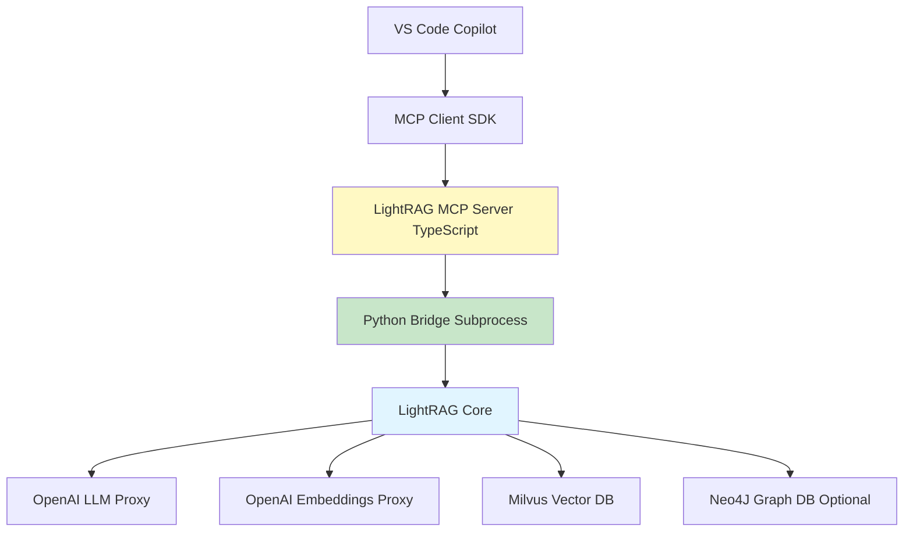

# Implementation Plan: LightRAG MCP Server for VS Code

**Project**: lightrag-mcp-server  
**Goal**: Graph-based code search MCP server integrating LightRAG with VS Code Copilot  
**Base Repos**: 
- netbrah/claude-context (MCP template)
- HKUDS/LightRAG (core engine)

**Author**: netbrah  
**Date**: 2025-11-12  
**Status**: Planning Phase

---

## Table of Contents

1. [Project Overview](#1-project-overview)
2. [Repository Structure](#2-repository-structure)
3. [Implementation Phases](#3-implementation-phases)
4. [Documentation](#4-documentation)
5. [Rollout Plan](#5-rollout-plan)
6. [Success Metrics](#6-success-metrics)
7. [Risk Mitigation](#7-risk-mitigation)
8. [Handoff Checklist](#8-handoff-checklist)
9. [Timeline Summary](#9-timeline-summary)

---

## 1. Project Overview

### 1.1 Architecture



### 1.2 Key Features

- **Graph-based code search**: Entities + relationships (not just vector similarity)
- **Multi-mode querying**: Local (focused), Global (architectural), Hybrid (both)
- **Visual representations**: Mermaid diagram generation
- **Incremental indexing**: Index files on-demand
- **Persistent storage**: Neo4J (optional) or NetworkX (file-based)
- **Vector storage**: Milvus (production) or NanoVectorDB (development)

---

## 2. Repository Structure

```
lightrag-mcp-server/
├── .github/
│   └── workflows/
│       ├── ci.yml                    # CI/CD pipeline
│       ├── test.yml                  # Integration tests
│       └── release.yml               # NPM/PyPI publishing
├── src/
│   ├── index.ts                      # MCP server entry point
│   ├── lightrag-bridge.ts            # Python subprocess manager
│   ├── tools/
│   │   ├── index-codebase.ts         # Tool: Index files
│   │   ├── search-code.ts            # Tool: Graph search
│   │   ├── get-entity.ts             # Tool: Entity details
│   │   ├── get-relationships.ts      # Tool: Relationships
│   │   ├── visualize-graph.ts        # Tool: Mermaid diagrams
│   │   └── get-indexing-status.ts    # Tool: Index status
│   ├── types.ts                      # TypeScript types
│   └── utils.ts                      # Helper functions
├── python/
│   ├── lightrag_wrapper.py           # JSON-RPC bridge to LightRAG
│   ├── requirements.txt              # Python dependencies
│   └── setup.py                      # Python package setup
├── tests/
│   ├── unit/
│   │   ├── bridge.test.ts            # Bridge unit tests
│   │   └── tools.test.ts             # Tool unit tests
│   ├── integration/
│   │   ├── indexing.test.ts          # Indexing integration tests
│   │   ├── search.test.ts            # Search integration tests
│   │   └── graph.test.ts             # Graph visualization tests
│   └── fixtures/
│       └── sample-codebase/          # Test C++ files
├── docs/
│   ├── SETUP.md                      # Installation guide
│   ├── USAGE.md                      # Usage examples
│   ├── ARCHITECTURE.md               # Architecture details
│   └── TROUBLESHOOTING.md            # Common issues
├── .copilot/
│   └── setup/
│       ├── install.yml               # Installation action
│       ├── configure.yml             # Configuration action
│       └── test.yml                  # Testing action
├── package.json
├── tsconfig.json
├── jest.config.js
├── .env.example
└── README.md
```

---

## 3. Implementation Phases

### Phase 1: Core Infrastructure (Week 1)

**Goal**: Set up project skeleton and Python-TypeScript bridge

#### 3.1.1 Tasks

- [ ] **Initialize repository**
  - Create GitHub repo `netbrah/lightrag-mcp-server`
  - Set up `.gitignore` for Node/Python
  - Create initial `README.md`
  - Set up branch protection (require PR reviews)

- [ ] **Python bridge wrapper** (`python/lightrag_wrapper.py`)
  - Create `LightRAGWrapper` class
  - Implement JSON-RPC stdin/stdout handler
  - Add methods: `index_files`, `search_code`, `get_entity`, `get_relationships`, `visualize_subgraph`
  - Handle initialization/cleanup lifecycle
  - Add logging with `setup_logger`

- [ ] **TypeScript bridge manager** (`src/lightrag-bridge.ts`)
  - Spawn Python subprocess
  - Implement bidirectional JSON-RPC communication
  - Add request timeout handling (60s default)
  - Add process restart logic on crash
  - Implement health check ping/pong

- [ ] **Environment configuration**
  - Create `.env.example` with all required variables
  - Add config validation on startup
  - Support for both OpenAI direct and proxy URLs

#### 3.1.2 Unit Tests

```typescript
// tests/unit/bridge.test.ts
describe('LightRAGBridge', () => {
  test('spawns Python process successfully', async () => {
    const bridge = new LightRAGBridge(config);
    await bridge.start();
    expect(bridge.isRunning()).toBe(true);
  });

  test('handles JSON-RPC request/response', async () => {
    const result = await bridge.call('search_code', { query: 'test' });
    expect(result).toHaveProperty('query');
  });

  test('restarts process on crash', async () => {
    bridge.pythonProcess.kill();
    await sleep(1000);
    expect(bridge.isRunning()).toBe(true);
  });

  test('times out long-running requests', async () => {
    await expect(
      bridge.call('slow_method', {}, { timeout: 100 })
    ).rejects.toThrow('Request timeout');
  });
});
```

#### 3.1.3 Integration Tests

```typescript
// tests/integration/bridge.test.ts
describe('Python-TypeScript Bridge Integration', () => {
  test('end-to-end search request', async () => {
    const bridge = new LightRAGBridge(config);
    await bridge.start();
    
    // Index test file
    await bridge.call('index_files', {
      file_paths: ['tests/fixtures/sample.cpp']
    });
    
    // Search
    const result = await bridge.call('search_code', {
      query: 'What does MyClass do?',
      mode: 'hybrid'
    });
    
    expect(result.answer).toContain('MyClass');
  });
});
```

---

### Phase 2: MCP Server Implementation (Week 2)

**Goal**: Implement MCP protocol and tool handlers

#### 3.2.1 Tasks

- [ ] **MCP server setup** (`src/index.ts`)
  - Initialize `@modelcontextprotocol/sdk` server
  - Set up stdio transport
  - Register capabilities: tools
  - Add error handling middleware
  - Implement graceful shutdown

- [ ] **Tool implementations** (`src/tools/*.ts`)

**Tool 1: lightrag_index_codebase**

```typescript
inputSchema: {
  workspace_path: string;
  file_patterns: string[];  // e.g., ["**/*.cc", "**/*.h"]
  exclude_patterns?: string[];
  batch_size?: number;
}
```

**Tool 2: lightrag_search_code**

```typescript
inputSchema: {
  query: string;
  mode: 'local' | 'global' | 'hybrid' | 'mix' | 'naive';
  top_k?: number;
  only_context?: boolean;
}
```

**Tool 3: lightrag_get_entity**

```typescript
inputSchema: {
  entity_name: string;
}
```

**Tool 4: lightrag_get_relationships**

```typescript
inputSchema: {
  entity_name: string;
  relation_type?: 'calls' | 'inherits' | 'depends_on';
  depth?: number;
}
```

**Tool 5: lightrag_visualize_subgraph**

```typescript
inputSchema: {
  query: string;
  format: 'mermaid';
  max_nodes?: number;
}
```

**Tool 6: lightrag_get_indexing_status**

```typescript
inputSchema: {} // No params
```

- [ ] **Response formatting**
  - Structured JSON output
  - Mermaid diagram wrapping in markdown code blocks
  - Error messages with actionable suggestions

#### 3.2.2 Unit Tests

```typescript
// tests/unit/tools.test.ts
describe('Tool Handlers', () => {
  describe('lightrag_search_code', () => {
    test('validates required parameters', async () => {
      await expect(
        handleSearchCode({})
      ).rejects.toThrow('Missing required parameter: query');
    });

    test('returns formatted search results', async () => {
      const result = await handleSearchCode({
        query: 'Find MyClass',
        mode: 'hybrid'
      });
      
      expect(result).toHaveProperty('content');
      expect(result.content[0].type).toBe('text');
    });
  });

  describe('lightrag_visualize_subgraph', () => {
    test('generates valid Mermaid diagram', async () => {
      const result = await handleVisualizeSubgraph({
        query: 'Show MyClass dependencies'
      });
      
      const text = JSON.parse(result.content[0].text);
      expect(text.diagram).toMatch(/^graph TD/);
    });
  });
});
```

#### 3.2.3 Integration Tests

```typescript
// tests/integration/mcp-tools.test.ts
describe('MCP Tools End-to-End', () => {
  let server: LightRAGMCPServer;

  beforeAll(async () => {
    server = new LightRAGMCPServer(testConfig);
    await server.start();
  });

  test('index → search → visualize workflow', async () => {
    // 1. Index test codebase
    const indexResult = await server.callTool('lightrag_index_codebase', {
      workspace_path: 'tests/fixtures/sample-codebase',
      file_patterns: ['**/*.cpp', '**/*.h']
    });
    expect(indexResult.success_count).toBeGreaterThan(0);

    // 2. Search for entity
    const searchResult = await server.callTool('lightrag_search_code', {
      query: 'What is the purpose of Iterator class?',
      mode: 'local'
    });
    expect(searchResult.answer).toBeDefined();

    // 3. Get relationships
    const relResult = await server.callTool('lightrag_get_relationships', {
      entity_name: 'Iterator'
    });
    expect(relResult.relationships.length).toBeGreaterThan(0);

    // 4. Visualize
    const vizResult = await server.callTool('lightrag_visualize_subgraph', {
      query: 'Show Iterator class hierarchy'
    });
    expect(vizResult.diagram).toContain('graph TD');
  });
});
```

---

### Phase 3: Storage Backends (Week 3)

**Goal**: Implement Neo4J and Milvus integration

#### 3.3.1 Tasks

- [ ] **Configuration layer**
  - Detect available storage backends
  - Fallback chain: Neo4J → NetworkX, Milvus → NanoVectorDB
  - Connection validation on startup

- [ ] **Neo4J integration**
  - Docker Compose setup for development
  - Connection pooling
  - Cypher query helpers
  - Schema validation

- [ ] **Milvus integration**
  - Use existing Milvus instance at 172.29.61.251:19530
  - Collection management (create/list/delete)
  - Batch insertion optimization
  - Index tuning for code embeddings

- [ ] **Migration tools**
  - Export NetworkX → Neo4J
  - Export NanoVectorDB → Milvus
  - Backup/restore utilities

#### 3.3.2 Unit Tests

```typescript
// tests/unit/storage.test.ts
describe('Storage Configuration', () => {
  test('detects Neo4J availability', async () => {
    const config = await detectStorageBackends();
    expect(config.graphStorage).toBe('Neo4JStorage');
  });

  test('falls back to NetworkX when Neo4J unavailable', async () => {
    const config = await detectStorageBackends({ neo4jUri: 'invalid' });
    expect(config.graphStorage).toBe('NetworkXStorage');
  });
});
```

#### 3.3.3 Integration Tests

```typescript
// tests/integration/storage.test.ts
describe('Storage Backend Integration', () => {
  test('Neo4J graph operations', async () => {
    const graph = new Neo4JGraphStorage(neo4jConfig);
    await graph.connect();
    
    // Create entities
    await graph.createEntity('MyClass', { type: 'class' });
    await graph.createEntity('MyFunction', { type: 'function' });
    
    // Create relationship
    await graph.createRelationship('MyFunction', 'MyClass', 'belongs_to');
    
    // Query
    const neighbors = await graph.getNeighbors('MyClass');
    expect(neighbors).toContainEqual('MyFunction');
  });

  test('Milvus vector operations', async () => {
    const vectorDB = new MilvusVectorStorage(milvusConfig);
    await vectorDB.connect();
    
    // Insert embeddings
    await vectorDB.insert([
      { id: 'file1', vector: [0.1, 0.2, ...], metadata: { path: 'a.cpp' } }
    ]);
    
    // Search
    const results = await vectorDB.search([0.1, 0.2, ...], top_k: 10);
    expect(results.length).toBeGreaterThan(0);
  });
});
```

---

### Phase 4: Incremental Indexing (Week 4)

**Goal**: Support real-time file watching and incremental updates

#### 3.4.1 Tasks

- [ ] **File watcher** (`src/indexer/watcher.ts`)
  - Use `chokidar` for file system watching
  - Debounce rapid changes (500ms default)
  - Filter by file patterns (.cc, .h, .cpp, .hpp)
  - Exclude build artifacts (.o, .a, .so)

- [ ] **Incremental indexing strategy**
  - Track indexed files in metadata DB
  - Compute file hashes (SHA-256) to detect changes
  - Partial graph updates (not full rebuild)
  - Incremental embeddings (only changed chunks)

- [ ] **Background indexing**
  - Queue-based processing (limit to 4 concurrent)
  - Progress reporting via MCP notifications
  - Cancelable operations

- [ ] **Tool: lightrag_watch_workspace**

```typescript
inputSchema: {
  workspace_path: string;
  file_patterns: string[];
  auto_index: boolean;
}
```

#### 3.4.2 Unit Tests

```typescript
// tests/unit/indexer.test.ts
describe('File Watcher', () => {
  test('detects file creation', async () => {
    const watcher = new FileWatcher(testDir, ['**/*.cpp']);
    const changes = [];
    watcher.on('change', (event) => changes.push(event));
    
    fs.writeFileSync(path.join(testDir, 'new.cpp'), 'int main() {}');
    await sleep(600); // Wait for debounce
    
    expect(changes).toContainEqual({ type: 'add', path: 'new.cpp' });
  });

  test('ignores build artifacts', async () => {
    const watcher = new FileWatcher(testDir, ['**/*.cpp']);
    const changes = [];
    watcher.on('change', (event) => changes.push(event));
    
    fs.writeFileSync(path.join(testDir, 'test.o'), 'binary');
    await sleep(600);
    
    expect(changes.length).toBe(0);
  });
});
```

#### 3.4.3 Integration Tests

```typescript
// tests/integration/incremental-indexing.test.ts
describe('Incremental Indexing', () => {
  test('updates index when file changes', async () => {
    const indexer = new IncrementalIndexer(config);
    await indexer.indexFile('test.cpp', 'class MyClass {};');
    
    // Modify file
    await indexer.indexFile('test.cpp', 'class MyClass { void foo(); };');
    
    // Search should reflect new content
    const result = await indexer.search('MyClass foo method');
    expect(result.answer).toContain('foo');
  });

  test('removes deleted files from index', async () => {
    await indexer.indexFile('temp.cpp', 'class TempClass {};');
    await indexer.removeFile('temp.cpp');
    
    const result = await indexer.search('TempClass');
    expect(result.answer).not.toContain('TempClass');
  });
});
```

---

### Phase 5: VS Code Integration (Week 5)

**Goal**: Seamless integration with VS Code Copilot

#### 3.5.1 Tasks

- [ ] **MCP configuration generator**
  - CLI command: `lightrag-mcp configure`
  - Auto-detect `.vscode/mcp.json` location
  - Prompt for missing credentials
  - Validate configuration

- [ ] **Copilot agent prompts** (`.copilot/agents/`)
  - `codebase-search.md`: Search entire codebase
  - `architecture-explore.md`: Explore architecture
  - `dependency-trace.md`: Trace dependencies

- [ ] **Copilot setup actions** (`.copilot/setup/`)

**install.yml**

```yaml
name: Install LightRAG MCP Server
on: [setup]
runs:
  - name: Install Node dependencies
    run: npm install
  - name: Install Python dependencies
    run: pip install -r python/requirements.txt
  - name: Build TypeScript
    run: npm run build
```

**configure.yml**

```yaml
name: Configure LightRAG
on: [setup]
prompts:
  - id: openai_api_key
    message: "Enter OpenAI API key"
    type: secret
  - id: milvus_address
    message: "Enter Milvus address (optional)"
    type: string
runs:
  - name: Generate MCP config
    run: lightrag-mcp configure --api-key=${{prompts.openai_api_key}}
```

- [ ] **Example `.vscode/mcp.json`**

```json
{
  "servers": {
    "lightrag": {
      "command": "node",
      "args": ["./node_modules/lightrag-mcp-server/dist/index.js"],
      "env": {
        "LIGHTRAG_WORKING_DIR": "${workspaceFolder}/.lightrag",
        "OPENAI_API_KEY": "${input:openai_api_key}",
        "OPENAI_BASE_URL": "https://llm-proxy-api.ai.eng.netapp.com/v1",
        "MILVUS_ADDRESS": "172.29.61.251:19530",
        "NEO4J_URI": "neo4j://localhost:7687"
      }
    }
  }
}
```

#### 3.5.2 Integration Tests

```typescript
// tests/integration/vscode.test.ts
describe('VS Code Integration', () => {
  test('loads MCP config from workspace', async () => {
    const config = await loadMCPConfig('.vscode/mcp.json');
    expect(config.servers.lightrag).toBeDefined();
  });

  test('runs in VS Code MCP environment', async () => {
    // Simulate VS Code MCP client
    const client = new MCPClient(stdioTransport);
    const tools = await client.listTools();
    
    expect(tools.find(t => t.name === 'lightrag_search_code')).toBeDefined();
  });
});
```

---

### Phase 6: CI/CD & Testing (Week 6)

**Goal**: Automated testing, linting, and release pipeline

#### 3.6.1 GitHub Actions Workflows

See [CI/CD Documentation](./CI_CD.md) for complete workflow configurations.

#### 3.6.2 Test Configuration

**jest.config.js**

```javascript
module.exports = {
  preset: 'ts-jest',
  testEnvironment: 'node',
  roots: ['<rootDir>/tests'],
  testMatch: ['**/*.test.ts'],
  collectCoverageFrom: [
    'src/**/*.ts',
    '!src/**/*.d.ts'
  ],
  coverageThreshold: {
    global: {
      branches: 80,
      functions: 80,
      lines: 80,
      statements: 80
    }
  },
  setupFilesAfterEnv: ['<rootDir>/tests/setup.ts']
};
```

**tests/setup.ts**

```typescript
import { config } from 'dotenv';
import path from 'path';

// Load test environment variables
config({ path: path.join(__dirname, '.env.test') });

// Global test timeout
jest.setTimeout(30000);

// Mock external services in unit tests
if (process.env.TEST_MODE === 'unit') {
  jest.mock('../src/lightrag-bridge');
}
```

#### 3.6.3 Test Coverage Goals

| Component | Unit Coverage | Integration Coverage |
|-----------|---------------|---------------------|
| MCP Server | 90% | 80% |
| Python Bridge | 85% | 90% |
| Tool Handlers | 90% | 85% |
| Storage Backends | 80% | 90% |
| File Watcher | 85% | 80% |

---

## 4. Documentation

### 4.1 User Documentation

- [Setup Guide](./SETUP.md)
- [Usage Guide](./USAGE.md)
- [Troubleshooting Guide](./TROUBLESHOOTING.md)

### 4.2 Developer Documentation

- [Architecture Details](./ARCHITECTURE.md)
- [Contributing Guide](./CONTRIBUTING.md)
- [API Reference](./API_REFERENCE.md)

---

## 5. Rollout Plan

### 5.1 Alpha Release (Week 7)

**Target Users**: Internal testing (netbrah only)

**Features**:
- ✅ Basic MCP server
- ✅ NetworkX + NanoVectorDB storage
- ✅ Search (local, global, hybrid)
- ✅ Basic visualization

**Testing**:
- Index `keymanager_mgwd` codebase (~5000 files)
- Run 100 test queries
- Measure accuracy vs `claude-context`

### 5.2 Beta Release (Week 8)

**Target Users**: Early adopters (GitHub issues/discussions)

**Features**:
- ✅ Neo4J + Milvus support
- ✅ Incremental indexing
- ✅ File watcher
- ✅ VS Code integration guide

**Testing**:
- Community feedback on 3 real codebases
- Performance benchmarks (indexing speed, query latency)
- Stability testing (24-hour runs)

### 5.3 v1.0 Release (Week 10)

**Target Users**: Public release (NPM/PyPI)

**Features**:
- ✅ All storage backends stable
- ✅ Complete documentation
- ✅ CI/CD pipeline
- ✅ Example codebases
- ✅ Video tutorials

**Announcement**:
- Blog post on Medium
- Tweet thread
- GitHub Discussions post
- Reddit r/vscode, r/MachineLearning

---

## 6. Success Metrics

### 6.1 Technical Metrics

| Metric | Target | Measurement |
|--------|--------|-------------|
| Indexing Speed | >100 files/min | Benchmark on 10K file codebase |
| Query Latency (local) | <2s | P95 across 1000 queries |
| Query Latency (global) | <5s | P95 across 1000 queries |
| Test Coverage | >80% | Jest/pytest coverage reports |
| Memory Usage | <2GB | Monitor during 10K file indexing |

### 6.2 Quality Metrics

| Metric | Target | Measurement |
|--------|--------|-------------|
| Search Accuracy | >85% | Manual evaluation of top-5 results |
| Graph Completeness | >90% | Entity/relationship extraction rate |
| Mermaid Diagram Quality | >80% valid | Parse rate + manual review |

### 6.3 Adoption Metrics

| Metric | Target (3 months) |
|--------|-------------------|
| GitHub Stars | 500+ |
| NPM Downloads | 1000+/week |
| Active Users | 50+ |
| Community PRs | 10+ |

---

## 7. Risk Mitigation

### 7.1 Technical Risks

| Risk | Impact | Mitigation |
|------|--------|------------|
| Python subprocess crashes | High | Auto-restart, health checks |
| Neo4J connection failures | Medium | Fallback to NetworkX |
| Milvus unavailable | Medium | Fallback to NanoVectorDB |
| LLM API rate limits | High | Request queuing, backoff |
| Large codebase OOM | High | Batch processing, streaming |

### 7.2 Schedule Risks

| Risk | Impact | Mitigation |
|------|--------|------------|
| LightRAG API changes | High | Pin version, fork if needed |
| MCP SDK breaking changes | Medium | Version pinning |
| Integration test failures | Medium | Parallel development tracks |

---

## 8. Handoff Checklist

Before handing to implementation agent, ensure:

- [ ] Complete LightRAG codebase downloaded
- [ ] Complete claude-context codebase downloaded
- [ ] All code samples from this conversation saved
- [ ] `.env.example` with all required variables
- [ ] `tests/fixtures/sample-codebase/` with test C++ files
- [ ] GitHub repo created: `netbrah/lightrag-mcp-server`
- [ ] Initial `README.md` with project overview
- [ ] GitHub secrets configured: `NPM_TOKEN`, `PYPI_API_TOKEN`

---

## 9. Timeline Summary

| Week | Phase | Deliverables |
|------|-------|-------------|
| 1 | Core Infrastructure | Python bridge, TypeScript bridge, tests |
| 2 | MCP Server | Tool handlers, MCP protocol, tests |
| 3 | Storage Backends | Neo4J, Milvus integration, tests |
| 4 | Incremental Indexing | File watcher, background indexing, tests |
| 5 | VS Code Integration | Copilot setup, agents, configuration |
| 6 | CI/CD & Testing | GitHub Actions, coverage, benchmarks |
| 7 | Alpha Release | Internal testing, bug fixes |
| 8 | Beta Release | Community feedback, performance tuning |
| 9 | Documentation | User guides, videos, examples |
| 10 | v1.0 Release | Public launch, announcements |

---

## Related Documentation

- [Architecture Details](./ARCHITECTURE.md)
- [Setup Guide](./SETUP.md)
- [Usage Guide](./USAGE.md)
- [Cascading Prompts](./CASCADING_PROMPTS.md)
- [Contributing Guide](./CONTRIBUTING.md)
- [Troubleshooting](./TROUBLESHOOTING.md)

---

**End of Implementation Plan**

Ready to proceed with implementation? 🚀
