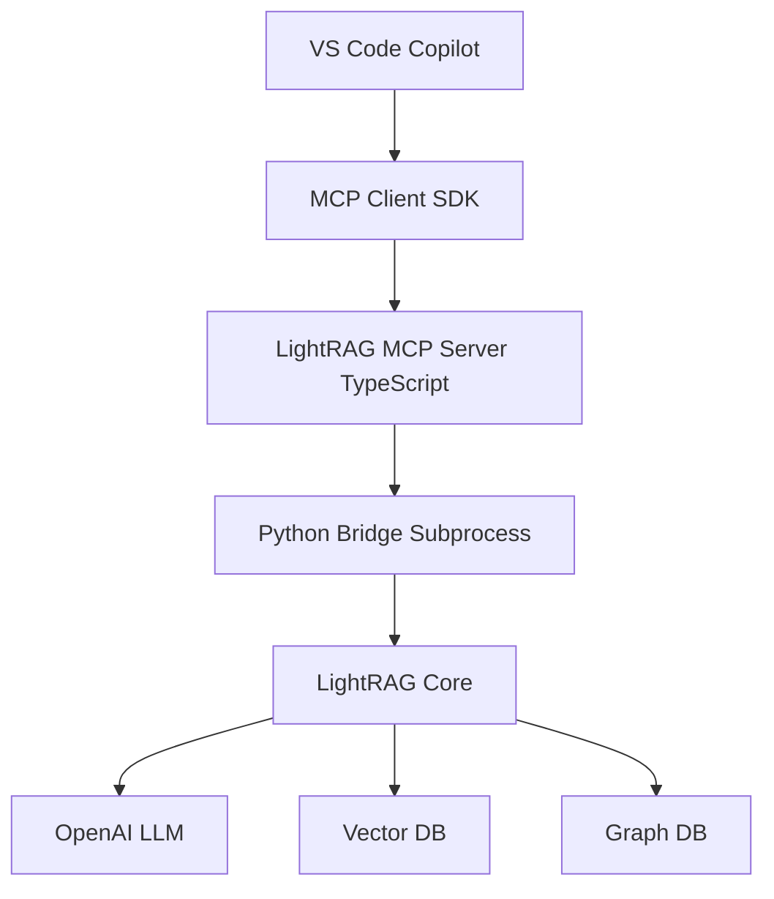

# LightRAG MCP Server Documentation

This directory contains comprehensive documentation for implementing and using the LightRAG MCP (Model Context Protocol) Server - a graph-based code search tool that integrates LightRAG with VS Code Copilot.

---

## 📚 Documentation Index

### Planning & Architecture

1. **[Implementation Plan](./IMPLEMENTATION_PLAN.md)** ⭐
   - Complete project roadmap
   - 6-phase development plan with timeline
   - Technical specifications for all components
   - Success metrics and rollout strategy
   - **Start here** for understanding the full project scope

2. **[Cascading Prompts](./CASCADING_PROMPTS.md)** 🔄
   - Sequential implementation guide
   - 11 self-contained agent prompts
   - Validation checkpoints between phases
   - Handoff protocols for team coordination
   - **Use this** for breaking down implementation into manageable tasks

3. **[Architecture Details](./ARCHITECTURE.md)** 🏗️
   - System architecture diagrams
   - Component specifications
   - Data flow documentation
   - Storage layer design
   - Communication protocols
   - **Reference this** for understanding how components interact

### User Guides

4. **[Setup Guide](./SETUP.md)** ⚙️
   - Installation instructions (development & production)
   - Configuration options
   - VS Code integration steps
   - Environment variable reference
   - **Start here** for getting the server running

5. **[Usage Guide](./USAGE.md)** 📖
   - Complete command reference
   - Search mode explanations (local, global, hybrid)
   - Example workflows for common tasks
   - Best practices and tips
   - **Reference this** for day-to-day usage

6. **[Troubleshooting](./TROUBLESHOOTING.md)** 🔧
   - Common issues and solutions
   - Diagnostic procedures
   - Error message explanations
   - Performance optimization
   - **Consult this** when things don't work as expected

### Developer Guides

7. **[Contributing Guide](./CONTRIBUTING.md)** 🤝
   - Development setup
   - Code standards (TypeScript & Python)
   - Testing guidelines
   - Pull request process
   - Architecture extension points
   - **Read this** before contributing code

---

## 🚀 Quick Start Paths

### For Project Managers

1. Read [Implementation Plan](./IMPLEMENTATION_PLAN.md) for full project scope
2. Review [Cascading Prompts](./CASCADING_PROMPTS.md) for task breakdown
3. Check timeline and success metrics

### For Developers (Implementation)

1. Review [Architecture Details](./ARCHITECTURE.md) to understand system design
2. Follow [Cascading Prompts](./CASCADING_PROMPTS.md) for implementation sequence
3. Reference [Contributing Guide](./CONTRIBUTING.md) for code standards

### For End Users

1. Start with [Setup Guide](./SETUP.md) for installation
2. Learn usage from [Usage Guide](./USAGE.md)
3. Refer to [Troubleshooting](./TROUBLESHOOTING.md) if needed

### For DevOps

1. Check [Setup Guide](./SETUP.md) production section
2. Review [Architecture Details](./ARCHITECTURE.md) storage backends
3. Set up CI/CD from [Implementation Plan](./IMPLEMENTATION_PLAN.md) Phase 6

---

## 📊 Project Overview

### What is LightRAG MCP Server?

A **graph-based code search** MCP server that brings LightRAG's advanced RAG capabilities to VS Code Copilot:

- 🔍 **Graph-based retrieval**: Not just vector similarity, but entity relationships
- 🌐 **Multi-mode querying**: Local (focused), Global (architectural), Hybrid (both)
- 📊 **Visual architecture**: Generate Mermaid diagrams from code relationships
- ⚡ **Incremental indexing**: Real-time updates as code changes
- 🗄️ **Flexible storage**: Development (NetworkX) and production (Neo4J + Milvus)

### Architecture at a Glance

### Key Components

| Component | Language | Purpose |
|-----------|----------|---------|
| MCP Server | TypeScript | Protocol handling, tool registration |
| Python Bridge | TypeScript | Subprocess management, JSON-RPC client |
| LightRAG Wrapper | Python | Bridge to LightRAG core, JSON-RPC server |
| LightRAG Core | Python | RAG engine, graph construction |

---

## 🎯 Implementation Timeline

| Week | Phase | Key Deliverables |
|------|-------|------------------|
| 1 | Core Infrastructure | Python bridge, TypeScript bridge |
| 2 | MCP Server | Tool handlers, protocol implementation |
| 3 | Storage Backends | Neo4J, Milvus integration |
| 4 | Incremental Indexing | File watcher, background indexing |
| 5 | VS Code Integration | Copilot configuration, CLI tools |
| 6 | CI/CD & Testing | GitHub Actions, test coverage |
| 7 | Alpha Release | Internal testing |
| 8 | Beta Release | Community feedback |
| 9 | Documentation | Guides, tutorials, videos |
| 10 | v1.0 Release | Public launch |

**See [Implementation Plan](./IMPLEMENTATION_PLAN.md) for detailed breakdown.**

---

## 🛠️ Technology Stack

### Frontend/Server Layer
- **TypeScript** with Node.js 18+
- **@modelcontextprotocol/sdk** for MCP protocol
- **chokidar** for file watching
- **zod** for schema validation

### Backend/Core Layer
- **Python** 3.11+
- **LightRAG** core library
- **OpenAI** API (or compatible proxy)

### Storage Layer
- **Development**: NetworkX (graph), NanoVectorDB (vector), JSON (KV)
- **Production**: Neo4J (graph), Milvus (vector), PostgreSQL (KV)

### Testing & CI/CD
- **Jest** (TypeScript tests)
- **pytest** (Python tests)
- **GitHub Actions** (CI/CD)
- **Docker Compose** (storage backends)

---

## 📝 Documentation Standards

All documentation in this directory follows these principles:

1. **Comprehensive**: Covers all aspects of planning, implementation, and usage
2. **Structured**: Clear table of contents and cross-references
3. **Practical**: Includes code examples, commands, and real-world scenarios
4. **Up-to-date**: Version number and last updated date on each document
5. **Accessible**: Written for different audiences (users, developers, managers)

### Document Format

Each document includes:
- **Title** and version
- **Table of contents**
- **Clear sections** with examples
- **Related documentation** links
- **Last updated** timestamp

---

## 🔗 External Resources

### LightRAG
- Repository: https://github.com/HKUDS/LightRAG
- Paper: https://arxiv.org/abs/2410.05779
- Documentation: See LightRAG repo

### Model Context Protocol (MCP)
- Specification: https://github.com/anthropics/mcp
- SDK: https://github.com/modelcontextprotocol/typescript-sdk

### VS Code Copilot
- Extension: https://marketplace.visualstudio.com/items?itemName=GitHub.copilot
- Documentation: https://code.visualstudio.com/docs/copilot

---

## 📞 Support & Community

- **GitHub Issues**: Report bugs or request features
- **GitHub Discussions**: Ask questions, share ideas
- **Discord**: Join community (link in main README)
- **Email**: For private inquiries (see main README)

---

## ✅ Documentation Checklist

### For Users
- [x] Installation guide (Setup)
- [x] Configuration reference (Setup)
- [x] Command reference (Usage)
- [x] Examples and workflows (Usage)
- [x] Troubleshooting guide
- [ ] Video tutorials (pending v1.0)
- [ ] FAQ (pending community questions)

### For Developers
- [x] Architecture documentation
- [x] Implementation guide (Cascading Prompts)
- [x] Contributing guidelines
- [x] Code standards
- [x] Testing guidelines
- [ ] API reference (pending implementation)

### For Project Management
- [x] Implementation plan
- [x] Timeline and milestones
- [x] Success metrics
- [x] Risk mitigation
- [x] Rollout strategy

---

## 📜 Version History

- **v1.0** (2025-11-12): Initial documentation release
  - Complete implementation plan
  - All user and developer guides
  - Architecture documentation
  - Contributing guidelines

---

## 🙏 Acknowledgments

This documentation is part of the LightRAG MCP Server project:

- **Project Lead**: netbrah
- **Base Technology**: LightRAG by HKUDS
- **Protocol**: Model Context Protocol by Anthropic
- **Integration Target**: GitHub Copilot by Microsoft

---

**Need help?** Start with the [Setup Guide](./SETUP.md) or consult the [Troubleshooting](./TROUBLESHOOTING.md) guide.

**Want to contribute?** Read the [Contributing Guide](./CONTRIBUTING.md) and check out [Cascading Prompts](./CASCADING_PROMPTS.md).

**Planning implementation?** Begin with the [Implementation Plan](./IMPLEMENTATION_PLAN.md) and [Architecture](./ARCHITECTURE.md).
