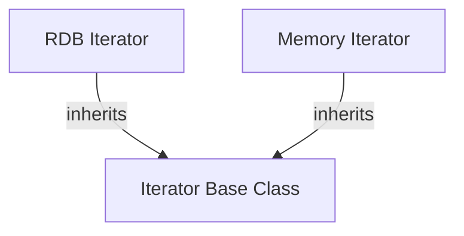

# LightRAG MCP Server Usage Guide

**Project**: lightrag-mcp-server  
**Version**: 1.0  
**Last Updated**: 2025-11-12

---

## Table of Contents

1. [Getting Started](#1-getting-started)
2. [Indexing Code](#2-indexing-code)
3. [Searching Code](#3-searching-code)
4. [Exploring Architecture](#4-exploring-architecture)
5. [Advanced Usage](#5-advanced-usage)
6. [Best Practices](#6-best-practices)

---

## 1. Getting Started

### 1.1 Basic Workflow

The typical workflow with LightRAG MCP Server:

1. **Index** your codebase
2. **Search** for specific entities or concepts
3. **Visualize** architecture and relationships
4. **Explore** entity details and dependencies

### 1.2 Accessing LightRAG in VS Code

All LightRAG commands are accessed through VS Code Copilot Chat using the `@lightrag` mention:

```
@lightrag <command>
```

### 1.3 Available Commands

| Command | Description |
|---------|-------------|
| `@lightrag index` | Index codebase files |
| `@lightrag search` | Search code using graph-based retrieval |
| `@lightrag visualize` | Generate architecture diagrams |
| `@lightrag get entity` | Get entity details |
| `@lightrag get relationships` | Get entity relationships |
| `@lightrag status` | Check indexing status |

---

## 2. Indexing Code

### 2.1 Basic Indexing

Index your entire workspace:

```
@lightrag index my codebase at ${workspaceFolder}
Include: **/*.cpp, **/*.h, **/*.cc, **/*.hpp
```

Index specific directory:

```
@lightrag index codebase at /path/to/project/src
Include: **/*.py
```

### 2.2 Filtering Files

#### Include Patterns

Use glob patterns to specify which files to index:

```
@lightrag index codebase at ~/myproject
Include: 
  - **/*.cpp
  - **/*.h
  - **/*.cc
  - **/*.hpp
```

#### Exclude Patterns

Exclude build artifacts and dependencies:

```
@lightrag index codebase at ~/myproject
Include: **/*.cpp, **/*.h
Exclude:
  - **/build/**
  - **/node_modules/**
  - **/.git/**
  - **/*.test.cpp
  - **/*.o
```

### 2.3 Batch Indexing

For large codebases, specify batch size:

```
@lightrag index codebase at ~/large-project
Include: **/*.cpp, **/*.h
Batch size: 50
Max concurrent: 8
```

### 2.4 Incremental Indexing

Index only modified files:

```
@lightrag index changed files since 2025-11-01
```

Index specific files:

```
@lightrag index files:
  - src/main.cpp
  - src/utils.cpp
  - include/utils.h
```

### 2.5 Watching for Changes

Enable automatic re-indexing on file changes:

```
@lightrag watch workspace at ~/myproject
Patterns: **/*.cpp, **/*.h
Auto-index: yes
```

Stop watching:

```
@lightrag stop watching
```

---

## 3. Searching Code

### 3.1 Search Modes

LightRAG provides multiple search modes optimized for different query types.

#### Local Search (Focused)

Best for: Specific entity details, method implementations, focused questions

```
@lightrag search: What does the Iterator class do?
Mode: local
```

```
@lightrag search: How is the validateInput function implemented?
Mode: local
```

**Characteristics**:
- Fast (<2s typical)
- High precision
- Returns specific code chunks
- Best for "what" and "how" questions about specific entities

#### Global Search (Architectural)

Best for: System architecture, design patterns, high-level overview

```
@lightrag search: What is the overall architecture of the authentication system?
Mode: global
```

```
@lightrag search: How is the plugin system designed?
Mode: global
```

**Characteristics**:
- Moderate speed (3-5s)
- Provides architectural context
- Returns community summaries
- Best for "why" and "what is the design" questions

#### Hybrid Search (Balanced)

Best for: Complex queries requiring both specific details and context

```
@lightrag search: How does the MetroCluster synchronization work?
Mode: hybrid
```

```
@lightrag search: Trace the execution flow of updateWkeydb function
Mode: hybrid
```

**Characteristics**:
- Combines local + global
- Balanced precision and context
- Moderate speed (2-4s)
- Best for "how does X work with Y" questions

#### Mix Search

Experimental: Uses multiple retrieval strategies

```
@lightrag search: Find all uses of the Database class
Mode: mix
```

#### Naive Search

Simple vector similarity search without graph

```
@lightrag search: Find similar error handling code
Mode: naive
```

### 3.2 Search Parameters

#### Top-K Results

Specify how many results to return:

```
@lightrag search: Find all Logger implementations
Mode: local
Top K: 20
```

#### Context-Only Mode

Get context chunks without LLM generation (faster):

```
@lightrag search: Find Iterator class
Mode: local
Only context: yes
```

### 3.3 Example Search Queries

#### Finding Implementations

```
@lightrag search: How is keymanager_keystore_enable_iterator implemented?
Mode: local
```

#### Understanding Dependencies

```
@lightrag search: What does the Iterator class depend on?
Mode: hybrid
```

#### Tracing Call Chains

```
@lightrag search: Trace the call chain from main() to processRequest()
Mode: hybrid
```

#### Finding Usage Examples

```
@lightrag search: Show examples of using the Database connection pool
Mode: local
Top K: 5
```

#### Architecture Questions

```
@lightrag search: Explain the layering and separation of concerns in this codebase
Mode: global
```

---

## 4. Exploring Architecture

### 4.1 Visualizing Relationships

#### Class Hierarchies

```
@lightrag visualize: Show the inheritance hierarchy of Iterator classes
```

Output:
````markdown

````

#### Module Dependencies

```
@lightrag visualize: Show dependencies between modules in src/
```

#### Call Graphs

```
@lightrag visualize: Show the call graph starting from main()
Max nodes: 20
```

### 4.2 Entity Details

Get detailed information about an entity:

```
@lightrag get entity: KeystoreManager
```

Response:
```json
{
  "name": "KeystoreManager",
  "type": "class",
  "description": "Manages keystore operations...",
  "source_file": "src/keystore/manager.cpp",
  "methods": [
    "initialize()",
    "enableIterator()",
    "disableIterator()"
  ],
  "relationships": {
    "inherits": [],
    "implements": ["IKeystoreManager"],
    "uses": ["Database", "Logger"],
    "used_by": ["KeystoreService"]
  }
}
```

### 4.3 Relationship Queries

Get all relationships for an entity:

```
@lightrag get relationships for: Database
```

Filter by relationship type:

```
@lightrag get relationships for: HttpClient
Type: calls
```

Get transitive relationships:

```
@lightrag get relationships for: MainController
Depth: 3
```

---

## 5. Advanced Usage

### 5.1 Multi-Repository Indexing

Index multiple repositories:

```
@lightrag index codebase at ~/project-a
Include: **/*.cpp, **/*.h
Namespace: project-a

@lightrag index codebase at ~/project-b
Include: **/*.cpp, **/*.h
Namespace: project-b
```

Search across repositories:

```
@lightrag search: How does authentication work?
Mode: hybrid
Namespaces: project-a, project-b
```

### 5.2 Custom Entity Extraction

Provide hints for better entity extraction:

```
@lightrag index codebase at ~/myproject
Include: **/*.cpp
Entity types: class, function, variable, macro
Extract patterns:
  - CALLBACK_* (callback functions)
  - *_RDB_* (database-related)
```

### 5.3 Integration with Copilot Workflows

#### Code Review

```
@lightrag search: What are the dependencies of the file I'm reviewing?
Mode: local
Context: current file

Then analyze the code for potential issues related to those dependencies.
```

#### Refactoring

```
@lightrag get relationships for: <ClassToRefactor>

Based on the relationships, suggest a safe refactoring plan that won't break dependencies.
```

#### Documentation Generation

```
@lightrag search: Explain the architecture of the authentication module
Mode: global

Generate API documentation based on this.
```

### 5.4 Performance Optimization

#### Caching

Frequently used queries are cached automatically. Force cache refresh:

```
@lightrag search: <query>
Mode: hybrid
Refresh cache: yes
```

#### Parallel Indexing

For very large codebases:

```
@lightrag index codebase at ~/huge-project
Include: **/*.cpp
Batch size: 100
Max concurrent: 16
Streaming: yes
```

---

## 6. Best Practices

### 6.1 Indexing Best Practices

1. **Start Small**
   - Index a subset first to validate patterns
   - Gradually expand to full codebase

2. **Use Appropriate Patterns**
   - Be specific with include patterns
   - Always exclude build artifacts and dependencies

3. **Incremental Updates**
   - Enable file watching for active development
   - Re-index only changed files

4. **Optimize Batch Size**
   - Smaller batches (10-20) for quick feedback
   - Larger batches (50-100) for bulk indexing

### 6.2 Search Best Practices

1. **Choose the Right Mode**
   - **Local**: "What does X do?" "How is Y implemented?"
   - **Global**: "What is the architecture?" "How is the system designed?"
   - **Hybrid**: "How does X work with Y?" "Trace the flow of Z"

2. **Be Specific**
   - Good: "How does the Iterator class handle errors?"
   - Poor: "Tell me about iterators"

3. **Use Context**
   - Reference specific files or modules
   - Mention related entities

4. **Iterate Queries**
   - Start with global to understand architecture
   - Then use local for specific details

### 6.3 Visualization Best Practices

1. **Limit Node Count**
   - Keep diagrams focused (max 20-30 nodes)
   - Use depth limits for transitive relationships

2. **Focus on Specific Areas**
   - Instead of "Show entire architecture"
   - Use "Show authentication module architecture"

3. **Combine with Search**
   - Search first to identify key entities
   - Then visualize their relationships

### 6.4 Performance Best Practices

1. **Storage Selection**
   - Development (<10K files): NetworkX + NanoVectorDB
   - Production (>10K files): Neo4J + Milvus

2. **Query Optimization**
   - Use `only_context: yes` when LLM generation not needed
   - Reduce `top_k` for faster results

3. **Memory Management**
   - Close VS Code periodically for long sessions
   - Monitor working directory size

---

## 7. Example Workflows

### 7.1 Onboarding to New Codebase

```
Step 1: Index the codebase
@lightrag index codebase at ~/new-project
Include: **/*.cpp, **/*.h

Step 2: Get architectural overview
@lightrag search: What is the overall architecture of this project?
Mode: global

Step 3: Understand main components
@lightrag visualize: Show the main modules and their relationships

Step 4: Deep dive into specific areas
@lightrag search: How does the [specific module] work?
Mode: hybrid
```

### 7.2 Debugging Workflow

```
Step 1: Find the function
@lightrag search: Find the implementation of buggyFunction
Mode: local

Step 2: Understand dependencies
@lightrag get relationships for: buggyFunction
Type: calls

Step 3: Trace call chain
@lightrag search: Trace the call chain leading to buggyFunction
Mode: hybrid

Step 4: Visualize
@lightrag visualize: Show the call graph around buggyFunction
Max nodes: 15
```

### 7.3 Refactoring Workflow

```
Step 1: Analyze current structure
@lightrag get entity: ClassToRefactor

Step 2: Find all usages
@lightrag get relationships for: ClassToRefactor
Type: used_by

Step 3: Understand dependencies
@lightrag visualize: Show dependencies of ClassToRefactor

Step 4: Search for similar patterns
@lightrag search: Find similar classes to ClassToRefactor
Mode: naive
```

---

## 8. Tips & Tricks

### 8.1 Query Optimization

- **Use quotes** for exact matches: `@lightrag search: "keymanager_keystore_enable_iterator"`
- **Specify file types**: `@lightrag search: Find class Iterator in *.h files`
- **Use boolean logic**: `@lightrag search: Find (class OR struct) in authentication module`

### 8.2 Combining Tools

Chain multiple LightRAG calls:

```
First: @lightrag search: What is AuthManager?
Then: @lightrag get relationships for: AuthManager
Finally: @lightrag visualize: Show AuthManager dependencies
```

### 8.3 Keyboard Shortcuts

While in Copilot Chat:
- `↑` / `↓`: Navigate command history
- `Ctrl+L`: Clear chat
- `Cmd/Ctrl+K`: Open Copilot

---

## Related Documentation

- [Implementation Plan](./IMPLEMENTATION_PLAN.md)
- [Architecture Details](./ARCHITECTURE.md)
- [Setup Guide](./SETUP.md)
- [Troubleshooting](./TROUBLESHOOTING.md)

---

**Document Version**: 1.0  
**Last Updated**: 2025-11-12
